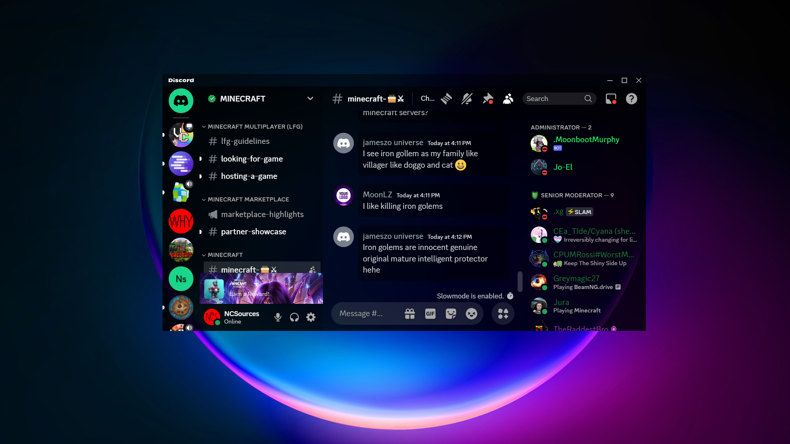
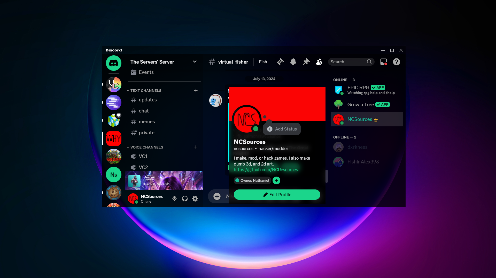
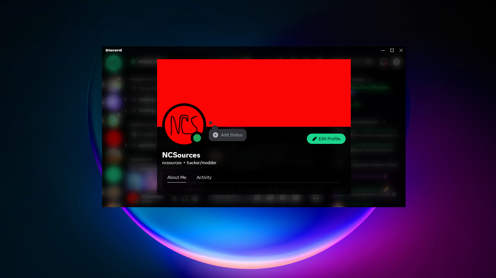
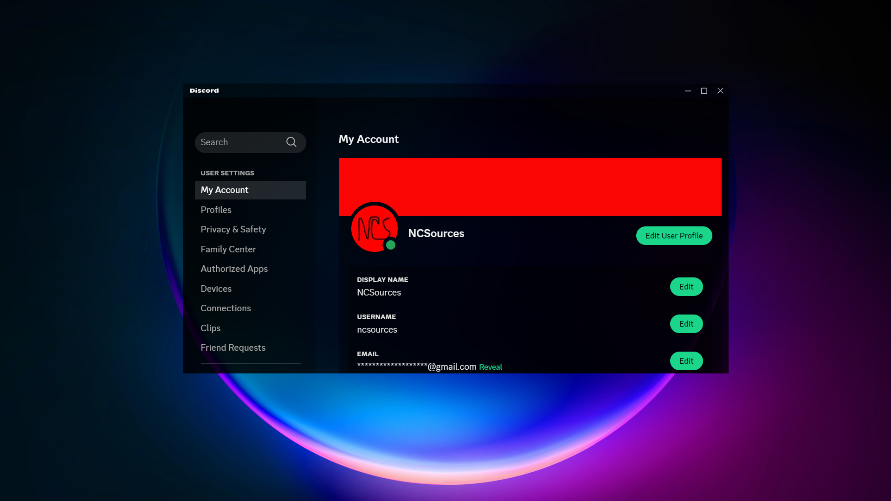
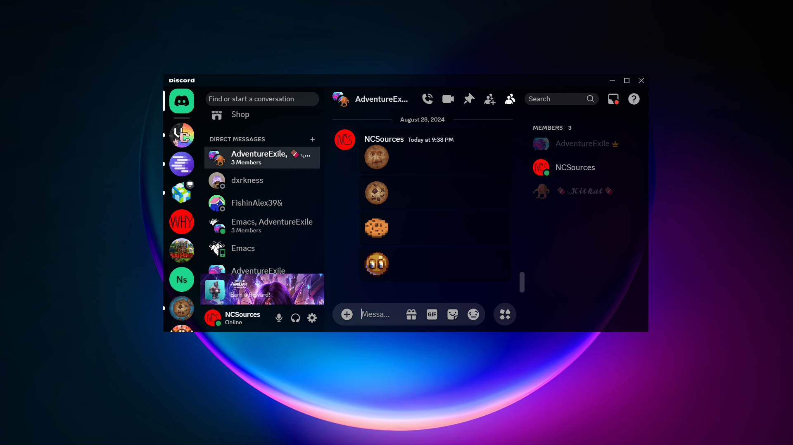

# Transparency
#### A fork of [Translucence by CapnKitten](https://github.com/CapnKitten/Translucence)
<hr>

Current version: v1.0 (8/28/2024)

Vencord link
```
https://raw.githubusercontent.com/NCSources0/Transparency/master/transparency.css
```

## Previews

#### Main chat area



#### User server info



#### User info popout



#### User settings



#### DMs



## Variables

#### App elements
 - `--app-bg` - The background image for the entire Discord app.<br>
 Default: `rgba(0,0,0,0.5)`

 - `--app-blur` - The strength of the blur for every element that has one.<br>
 Default: `6px`

 - `--app-margin` - The margin surrounding the content area.<br>
 Default: `0`

 - `--app-radius` - The border radius of the app and every element that has a border radius.<br>
 Default: `0`

 - `--sidebar-color` - The background color of the sidebars.<br>
 Default: `rgba(0,0,0, 0.4)`

 - `--main-content-color` - The background color of the main content areas.<br>
 Default: `rgba(0,0,0, 0.2)`

#### Accent color
 - `--accent-hue` - The hue value for the accent color of the theme. <br>
 Default: `156`

 - `--accent-saturation` - The saturation value for the accent color of the theme. <br>
 Default: `77.5%`

 - `--accent-lightness` - The lightness value for the accent color of the theme. <br>
 Default: `47.1%`

 - `--accent-opacity` - The opacity of everything, excluding text, that uses the accent color. <br>
 Default: `1`

 - `--accent-text-color` - The text color for buttons and other various elements with the accent background color. <br>
 Default: `#000`

#### Messages
 - `--message-color` - The background color for messages. <br>
 Default: `rgba(0,0,0, 0.4)`

 - `--message-radius` - The border radius for messages. <br>
 Default: `8px`

 - `--message-padding-top` - The top and bottom padding for messages. <br>
 Default: `8px`

 - `--message-padding-side` - The left and right padding for messages. <br>
 Default: `8px`

 - `--mention-hue` - The hue value for the message mention color. <br>
 Default: `156`

 - `--mention-saturation` - The saturation value for the message mention color. <br>
 Default: `77.5%`

 - `--mention-lightness` - The lightness value for the message mention color. <br>
 Default: `47.1%`

 - `--mention-opacity` - The opacity of the message mention color. <br>
 Default: `1`

 - `--reply-hue` - The hue value for the reply message color. <br>
 Default: `226`

 - `--reply-saturation` - The saturation value for the reply message color. <br>
 Default: `77.6%`

 - `--reply-lightness` - The lightness value for the reply message color. <br>
 Default: `61.8%`

 - `--reply-opacity` - The opacity of the reply message color. <br>
 Default: `1`

#### Textareas and inputs
 - `--textarea-color` - The background color for any textareas and inputs. <br>
 Default: `0,0,0`

 - `--textarea-alpha` - The opacity for any textareas and inputs. <br>
 Default: `0.15`

 - `--textarea-text-color` - The text color for textareas and inputs. <br>
 Default: `#fff`

 - `--textarea-radius` - The border radius for textareas (not inputs). <br>
 Default: `22px`

 - `--input-height` - The height for inputs. <br>
 Default: `36px`

 - `--input-radius` - The border radius for inputs (not textareas). <br>
 Default: `18px`

#### Cards
 - `--card-color` - The background color for cards. <br>
 Default: `rgba(0,0,0, 0.4)`

 - `--card-color-hover` - The background color for hovering over cards (if there is a hover animation). <br>
 Default: `rgba(0,0,0, 0.5)`

 - `--card-radius` - The border radius for cards. <br>
 Default: `8px`

#### Buttons
 - `--button-height` - The height for buttons. <br>
 Default: `32px`

 - `--button-padding` - The padding for buttons. <br>
 Default: `0 16px`

 - `--button-color` - The background color for most buttons. <br>
 Default: `#d73d3d`

 - `--button-action-color` - The background color for hovering and clicking on buttons (has a lowered opacity). <br>
 Default: `#000`

 - `--button-text-color` - The text color for any buttons that use `--button-color`. <br>
 Default: `#000`

 - `--button-radius` - The border radius for buttons. <br>
 Default: `8px`

#### Popouts and modals
 - `--popout-color` - The background color for modals/popouts. <br>
 Default: `rgba(0,0,0, 0.55)`

 - `--popout-blur` - The blur strength for modals/popouts. <br>
 Default: `5px`

 - `--popout-header-opacity` - The header opacity for modals/popouts. <br>
 Default: `0.3`

 - `--popout-header-shadow`- The shadow for headers in modals/popouts. <br>
 Default: `0px 3px 9px 0px rgba(0,0,0, 0.25)`

 - `--popout-radius` - The border radius for modals/popouts. <br>
 Default: `8px`

 - `--popout-shadow` - The shadow for modals/popouts. <br>
 Default: `0 8px 10px 1px rgba(0,0,0, 0.14)`